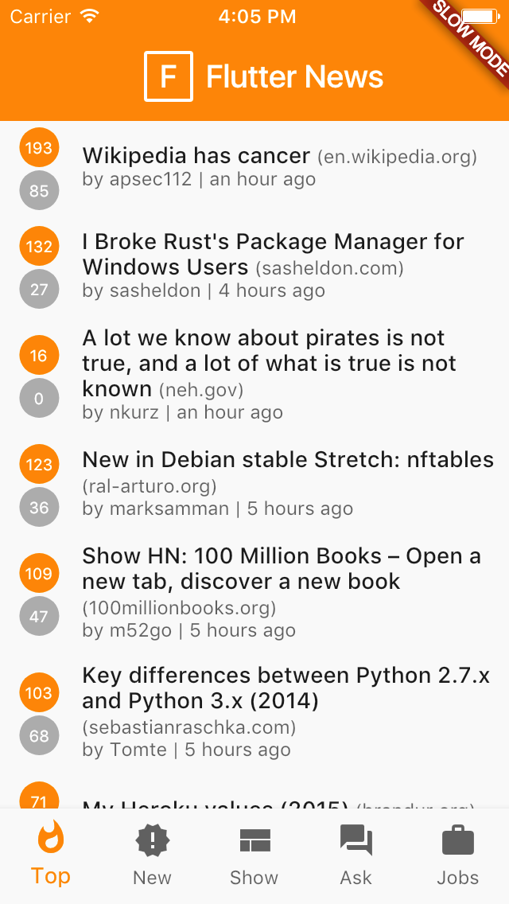

# flutter_news

A Hacker News client made with [Flutter](http://flutter.io/).

| iOS | Android |
| --- | ------- |
|  |  |

## TODO

- [ ] "Load more" when user reaches bottom of the list
- [x] Fetch news, show, ask, etc
- [x] Dark theme (add side bar menu) - thanks to jgroman 
- [x] Add fuzzy time ("timeago") 
- [x] Save user preferences  - thanks to jgroman
- [ ] Better layout for comments
- [ ] Share item
 
